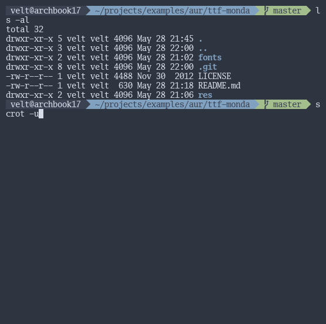
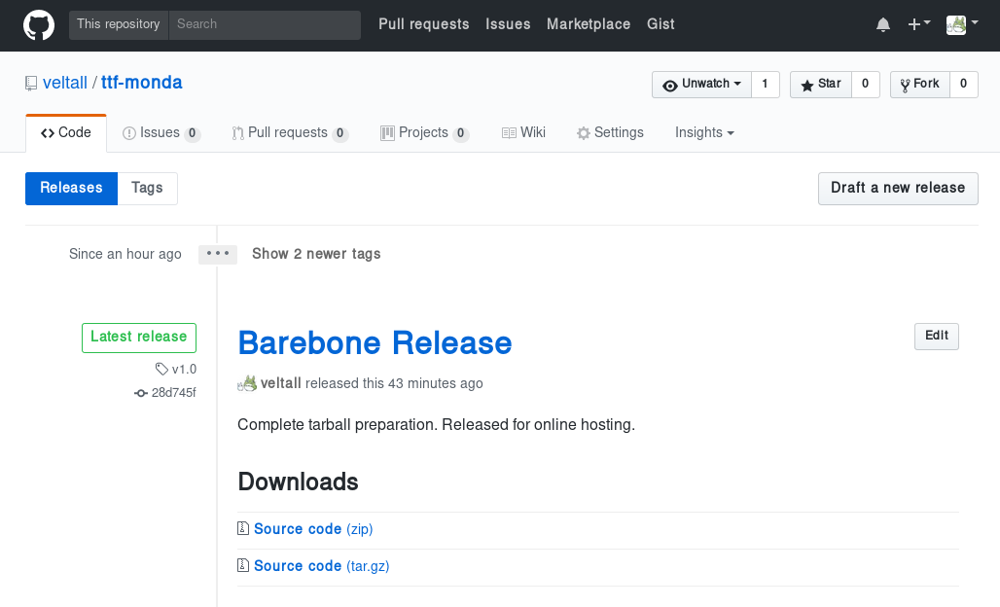
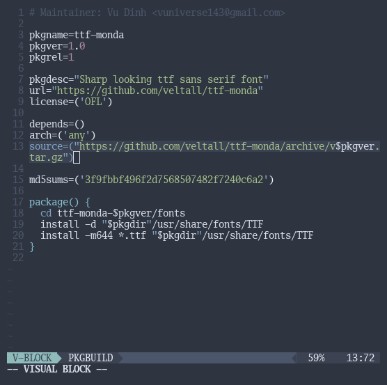

# AUR Packaging Example : ttf-monda

### Have access to the source code tarball

Inside the folder `./ttf-monda-1.0/fonts` are the files necessary for "installing" the font to the system; the rest are for the purpose of putting them on github. These files are to be hosted externally in a tarball.

An example is to host the "source files" on github and have the Github system generate a tarball when you **release** a tagged version. Alternatively, anything from Google Drive to Mega.nz can serve the `.tar.gz` file, but you'll have to generate it yourself with

    $ tar zcvf * project-1.0.tar.gz

### Modify PKGBUILD for every new version of the source code

Add this tarball URL to the `PKGBUILD` when modifying/updating other information.

For every new release (different tarball), modify the checksum to the PKGBUILD

    $ makepkg -g >> PKGBUILD

Voila.
